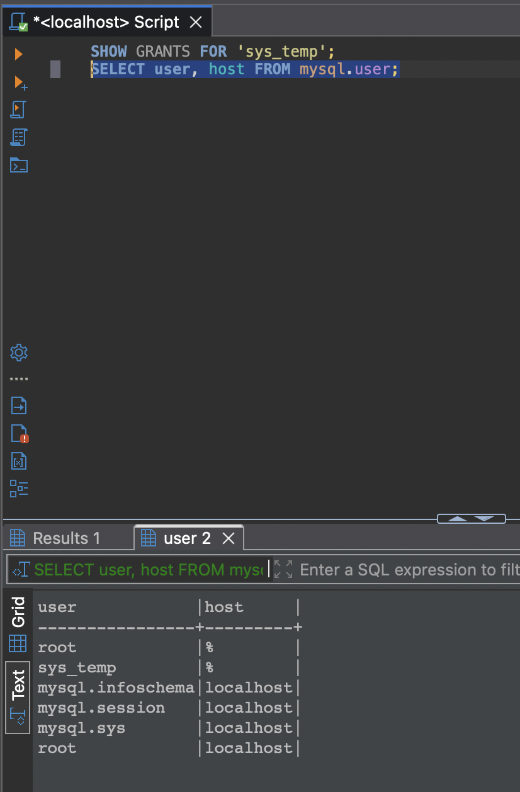
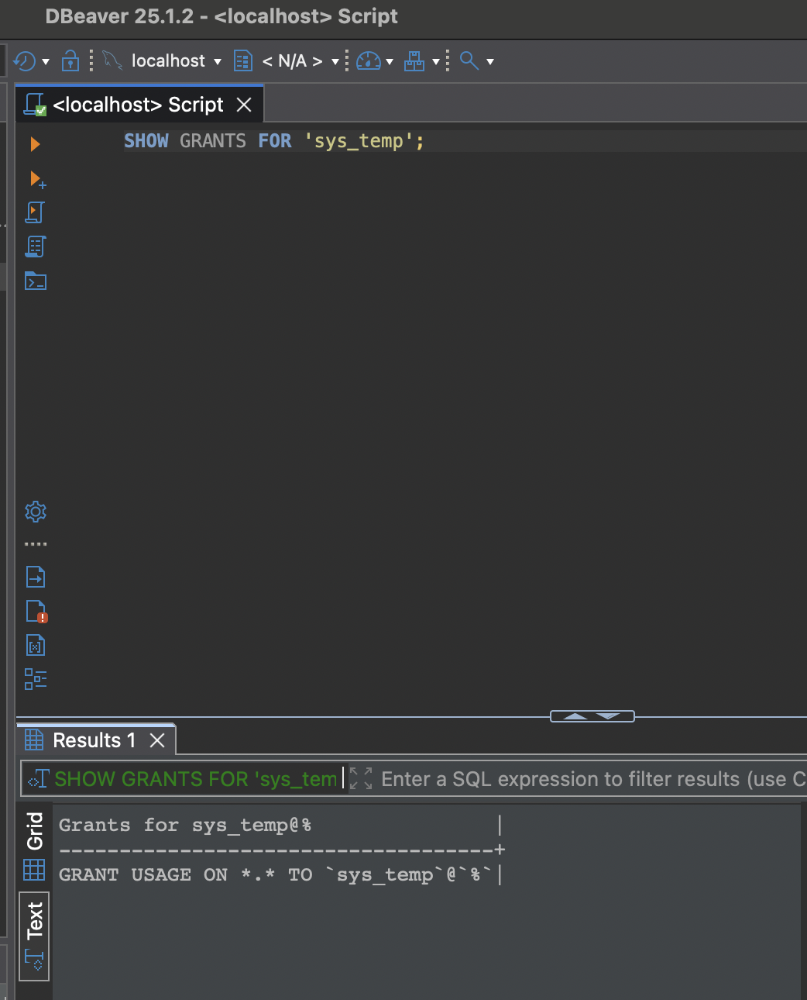
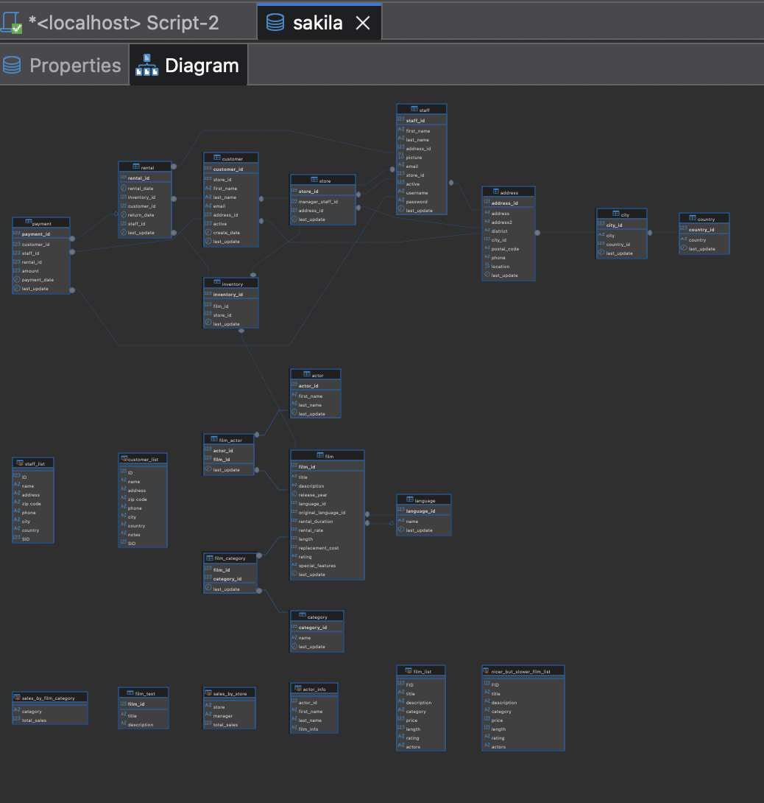
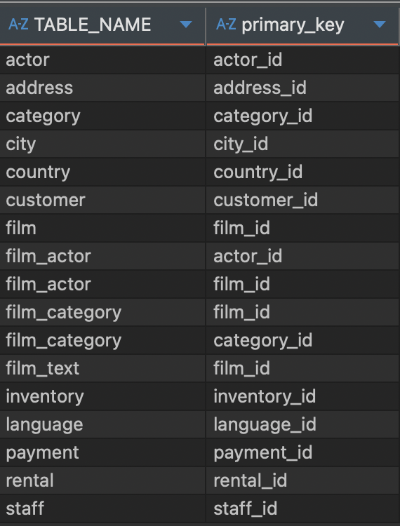
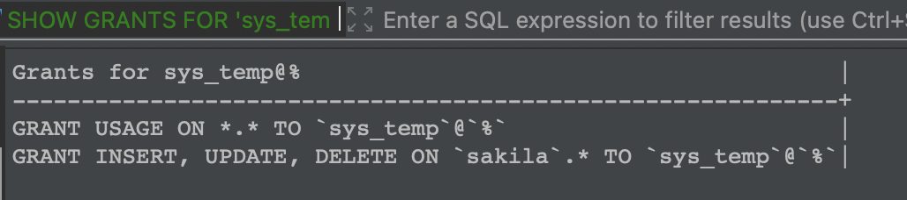

Домашнее задание к занятию "`Работа с данными (DDL/DML)`" - `Кошель Николай Павлович`


### Задание 1
1.1. Поднимите чистый инстанс MySQL версии 8.0+. Можно использовать локальный сервер или контейнер Docker.

1.2. Создайте учётную запись sys_temp.
```sql
CREATE USER 'sys_temp'@'%' IDENTIFIED BY '************'; 
```
1.3. Выполните запрос на получение списка пользователей в базе данных. (скриншот)
```sql
SELECT user, host FROM mysql.user;
```


1.4. Дайте все права для пользователя sys_temp.
```sql 
GRANT ALL PRIVILEGES ON *.* TO 'sys_temp'@'%';
```
1.5. Выполните запрос на получение списка прав для пользователя sys_temp. (скриншот)
```sql 
SHOW GRANTS FOR 'sys_temp';
```


1.6. Переподключитесь к базе данных от имени sys_temp.

Для смены типа аутентификации с sha2 используйте запрос: 
```sql
ALTER USER 'sys_test'@'localhost' IDENTIFIED WITH mysql_native_password BY 'password';
```
1.6. По ссылке https://downloads.mysql.com/docs/sakila-db.zip скачайте дамп базы данных.

1.7. Восстановите дамп в базу данных.
```
docker cp /Users/koshel_np/Downloads/sakila-db ef9179960ad9:/tmp
mysql -u sys_temp -p  < /tmp/sakila-db/sakila-schema.sql 
mysql -u sys_temp -p sakila < /tmp/sakila-db/sakila-data.sql
```

1.8. При работе в IDE сформируйте ER-диаграмму получившейся базы данных. При работе в командной строке используйте команду для получения всех таблиц базы данных. (скриншот)

*Результатом работы должны быть скриншоты обозначенных заданий, а также простыня со всеми запросами.*


### Задание 2
Составьте таблицу, используя любой текстовый редактор или Excel, в которой должно быть два столбца: в первом должны быть названия таблиц восстановленной базы, во втором названия первичных ключей этих таблиц. Пример: (скриншот/текст)
```
Название таблицы | Название первичного ключа
customer         | customer_id
```
```
SELECT 
    TABLE_NAME, 
    COLUMN_NAME AS primary_key
FROM 
    INFORMATION_SCHEMA.COLUMNS
WHERE 
    TABLE_SCHEMA = 'sakila' 
    AND COLUMN_KEY = 'PRI';
```
[Название таблиц и их первичные ключи](COLUMNS_202507281208.csv)

## Дополнительные задания (со звёздочкой*)
Эти задания дополнительные, то есть не обязательные к выполнению, и никак не повлияют на получение вами зачёта по этому домашнему заданию. Вы можете их выполнить, если хотите глубже шире разобраться в материале.

### Задание 3*
3.1. Уберите у пользователя sys_temp права на внесение, изменение и удаление данных из базы sakila.
```
GRANT INSERT, UPDATE, DELETE ON sakila.* TO sys_temp;
```
3.2. Выполните запрос на получение списка прав для пользователя sys_temp. (скриншот)

*Результатом работы должны быть скриншоты обозначенных заданий, а также простыня со всеми запросами.*
